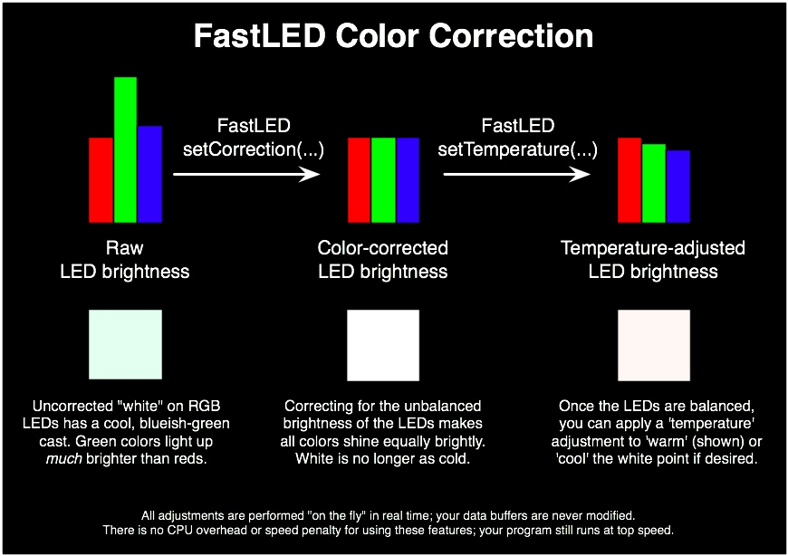

The green LEDs in your LED pixels shine much more brightly than the red or blue LEDs; this means that any color you try to mix is inherently 'too green' unless you correct for that somehow.   FastLED v2.1 (and later) have features that let you control the overall color balance and temperature of your projects, so that you get exactly the colors you wanted.
  

You don't have to use any of the color management functions in FastLED v2.1, but setting the color correction to something approximately like the right values for a given LED strip (just eyeball it and try different settings) can make a big difference in the overall quality and appearance of a project.
