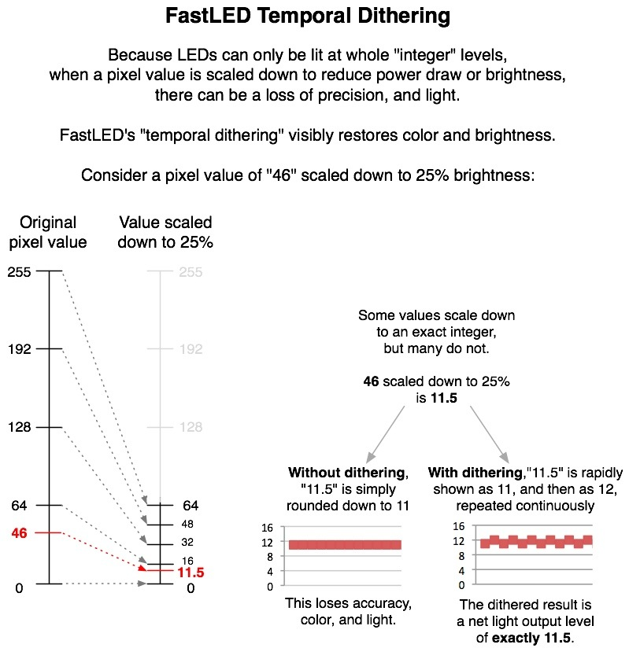

FastLED users can easily scale the brightness and power consumption of their projects with FastLED.setBrightness( 0..255 ).  FastLED v2.1 (and later) includes automatic "temporal dithering" which helps preserve color and light when the brightness is turned down.  To take advantage of temporal dithering:

* Code your animations as if they were going to run at normal full brightness; use the full range of 0..255 for RGB and HSV values as much as you wish.

* Use FastLED.setBrightness( 0..255) to adjust the brightness of your whole animation.  The FastLED temporal dithering will 'kick in' automatically as you lower the master brightness control.

* In place of the standard "delay(...)" function, use "FastLED.delay(...)".  FastLED will use the 'delay time' to keep the LEDs refreshed with dithered pixel values.

Other details:

* To disable temporal dithering, for POV or light painting projects, use "FastLED.setDither( 0 );".  If you turn off dithering, the library reverts back to 'flooring' integer values, instead of dithering them.

* Temporal dithering has no effect at full brightness (255).  It exists to preserve high quality color and accurate light output when the master brightness control is turned down to save power or manage brightness.

* The more often your code calls FastLED.show(), or FastLED.delay(), the higher-quality the dithering will be, because FastLED can refresh the LEDs faster and more often.

* If you are refreshing the LEDs less frequently (e.g., if you have a hundreds of LEDs, or computationally intensive animations), and you are running at a low brightness level, you may see the dithered pixel output as flickering, and you may want to turn it off if the effect is distracting.  It's not magic; it's up to you what looks good in your projects.
