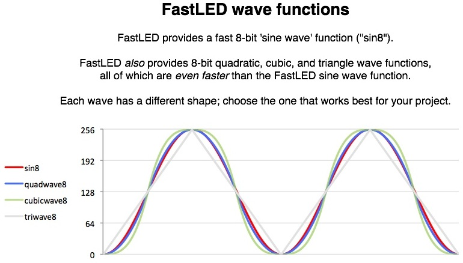

LED projects often benefit from smooth wave functions to control colors, brightnesses, motion, or other aspects of an animation.  FastLED provides a number of fast, efficient, smooth wave functions.  Of particular note are sin8/cos8 and sin16/cos16.  These are high-performance integer approximations of 'sine' and 'cosine', when those particular wave functions are needed.  

However, FastLED also offers several other wave functions which may be better suited for some animations.  Typically, animation code found 'in the wild' uses floating point sine and cosine waves -- mostly because (1) they look nice, and (2) sine and cosine functions are often 'built in' to many environments.  Sine and cosine are rarely chosen for use in an animation because those exact trigonometric relationships are needed!

You should experiment with different wave functions, and see which ones look best to you, and perform best in your projects.
 

In order from fastest to slowest, here are the wave functions that FastLED provides:

### 8-bit wave functions

These functions take an 8-bit unsigned integer (uint8_t) and return an 8-bit unsigned integer (uint8_t).

* triwave8( i) -- a triangle wave, aka sawtooth, aka a simple zig zag up and down.
* quadwave8( i) -- quadratic in/out easing applied to a triangle wave.  This makes nearly a sine wave, but takes only about 2/3rds of the CPU cycles of FastLED's fastest sine function.
* cubicwave8( i) -- cubic in/out easing applied to a triangle wave.  This makes a 'higher contrast' wave than the quad or sine wave.  10-20% faster than FastLED's fastest sine function.
* sin8( i) -- FastLED's 8-bit sine wave approximation.  It's more than 99% accurate across all thetas, and never off by more than a couple of percent.  On AVR processors, it's more roughly 20X as fast as Arduino's built-in floating point sin(x) routine.  cos8(i) is also provided.

Depending on context and usage, these wave functions can be as fast or faster than using a lookup table to generate wave values.  (And they use a heck of a lot less RAM.)  Since particular projects and code differ greatly, you are encouraged to try different options and select the one that works best in your particular circumstances.

### 16-bit wave functions

These functions take an 16-bit unsigned integer (uint16_t) and return a _signed_ 16-bit integer (int16_t).

* sin16(i) -- FastLED's higher-precision sine routine.  Accurate to within one-half of one percent in all cases.  Much faster than Arduino's built-in floating point sin(x) function.
* cos16(i) -- FastLED's higher-precision cosine routine.  Accurate to within one-half of one percent in all cases.  Much faster than Arduino's built-in floating point cos(x) function.

